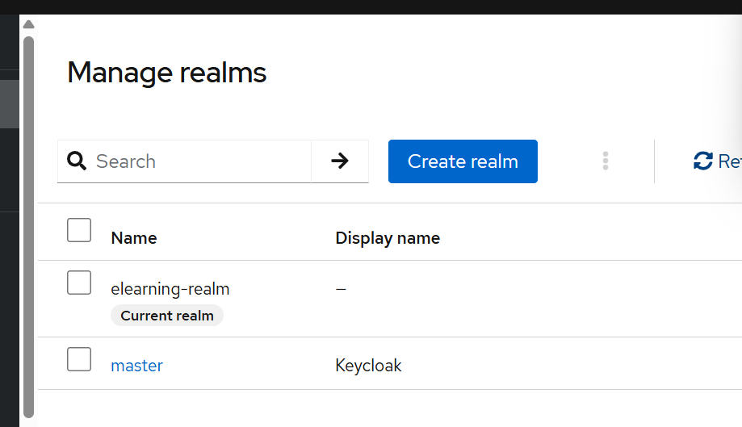
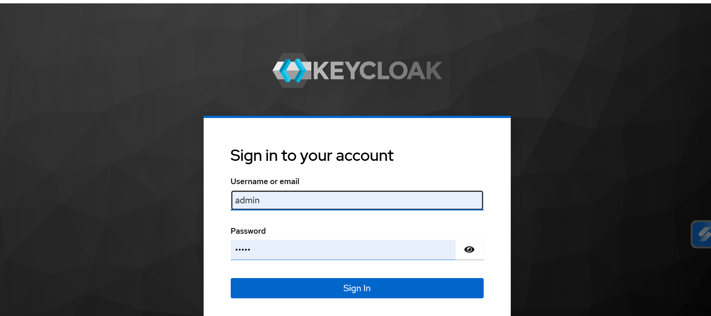
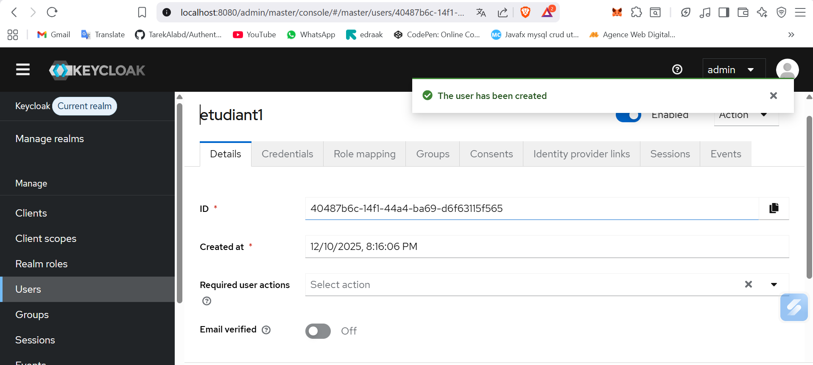
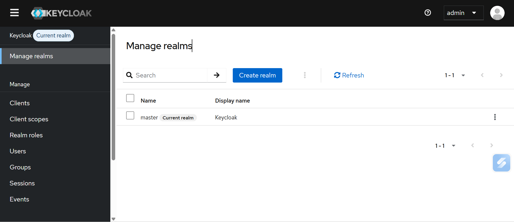
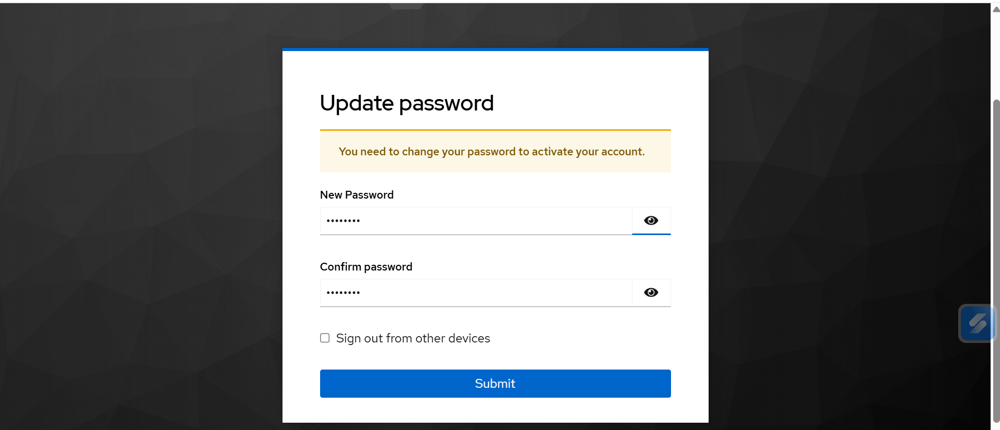
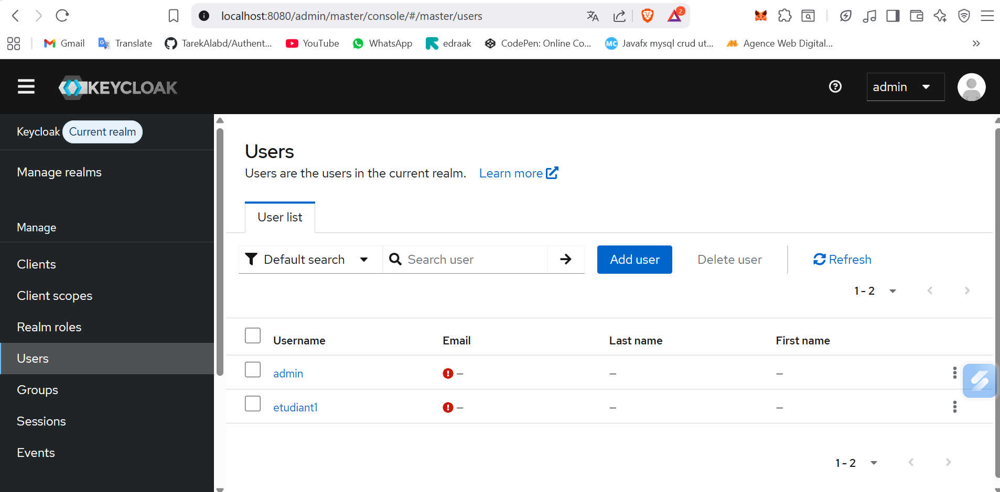
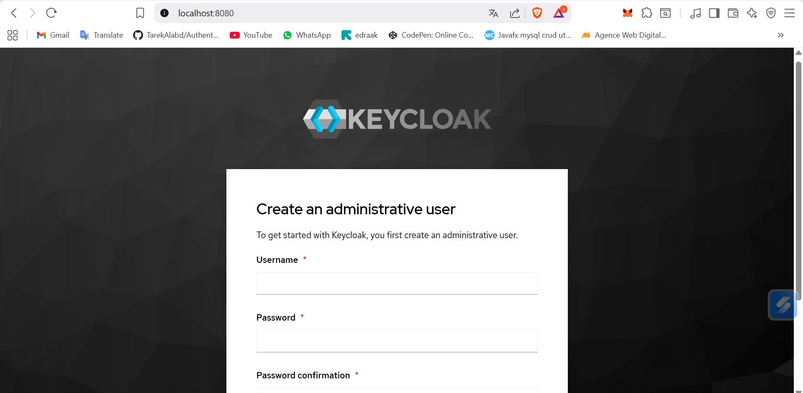
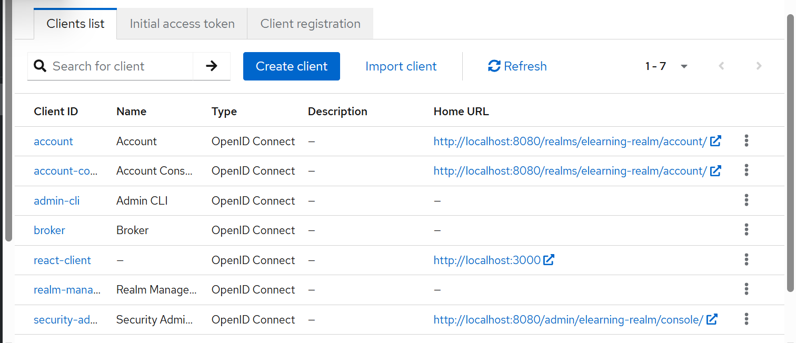
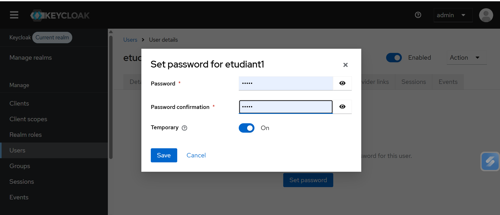

# Sécurisation d'une Application E-Learning avec OAuth2, OpenID Connect & Keycloak

## Description du Projet

Ce projet est une **plateforme E-Learning sécurisée** qui implémente une architecture complète d'authentification et d'autorisation moderne en utilisant **OAuth2** et **OpenID Connect** via **Keycloak**. L'application permet aux étudiants de consulter des cours et aux administrateurs de gérer le contenu de la plateforme.

---

## Architecture du Projet

L'application suit une architecture à trois couches :

### 1. **Frontend (React)**
- Interface utilisateur développée avec React
- Intégration de Keycloak-js pour l'authentification
- Gestion des tokens JWT automatique
- Interface adaptative selon les rôles (STUDENT / ADMIN)

### 2. **Backend (Spring Boot)**
- API RESTful sécurisée
- Configuration OAuth2 Resource Server
- Validation des tokens JWT
- Contrôle d'accès basé sur les rôles (RBAC)
- Gestion des cours

### 3. **Serveur d'Authentification (Keycloak)**
- Gestion centralisée de l'authentification
- Serveur OAuth2 / OpenID Connect
- Gestion des utilisateurs et des rôles
- Émission et validation des tokens JWT

---

## Technologies Utilisées

### Backend
- **Java 17+**
- **Spring Boot 3**
- **Spring Security OAuth2 Resource Server**
- **Spring Web**

### Frontend
- **React 18**
- **Keycloak-js**
- **JavaScript (ES6+)**

### Sécurité & Authentification
- **Keycloak 23**
- **OAuth2**
- **OpenID Connect**
- **JWT (JSON Web Tokens)**

---

## Configuration de Keycloak

### Étape 1 : Installation et Démarrage de Keycloak



Au premier démarrage de Keycloak, créez un utilisateur administrateur pour accéder à la console d'administration.

### Étape 2 : Créer un Realm


Un realm dans Keycloak est un espace isolé qui gère un ensemble d'utilisateurs, d'applications, de rôles et de configurations. Créez un nouveau realm nommé **"elearning-realm"**.

### Étape 3 : Configurer les Clients



Les clients représentent les applications qui utiliseront Keycloak pour l'authentification. Créez deux clients :

#### Client React (react-client)
- **Client ID** : react-client
- **Client Protocol** : openid-connect
- **Access Type** : public
- **Valid Redirect URIs** : http://localhost:3000/*
- **Web Origins** : http://localhost:3000

### Étape 4 : Créer les Rôles

Créez deux rôles dans le realm :
- **STUDENT** : Pour les étudiants qui peuvent consulter les cours
- **ADMIN** : Pour les administrateurs qui peuvent gérer les cours

### Étape 5 : Créer les Utilisateurs



Créez deux utilisateurs de test :

#### Utilisateur Admin
- **Username** : admin
- **Email** : nohailaamo@gmail.com
- **Rôle** : ADMIN



#### Utilisateur Étudiant
- **Username** : etudiant1
- **Rôle** : STUDENT



### Étape 6 : Configuration des Mots de Passe



Lors de la création d'un utilisateur, configurez un mot de passe temporaire. L'utilisateur devra le changer à sa première connexion.



---

## Configuration Spring Boot (Backend)

### Configuration de la Sécurité

Le backend Spring Boot est configuré comme un **OAuth2 Resource Server** qui valide les tokens JWT émis par Keycloak.

**Fichier : application.properties**

```
spring.application.name=tpoAuth2OpenId
server.port=8081

spring.security.oauth2.resourceserver.jwt.issuer-uri=http://localhost:8080/realms/elearning-realm
spring.security.oauth2.resourceserver.jwt.jwk-set-uri=http://localhost:8080/realms/elearning-realm/protocol/openid-connect/certs
```

### Points Clés de la Configuration Backend

1. **SecurityFilterChain** : Configure la chaîne de filtres de sécurité
   - Active CORS pour permettre les requêtes depuis React
   - Protège tous les endpoints (sauf /actuator)
   - Configure le serveur de ressources OAuth2 avec JWT

2. **JwtAuthenticationConverter** : Extrait les rôles depuis le token JWT
   - Récupère les rôles depuis "realm_access" → "roles"
   - Ajoute le préfixe "ROLE_" pour Spring Security
   - Permet l'utilisation de @PreAuthorize

3. **CorsConfiguration** : Configure CORS
   - Autorise les requêtes depuis http://localhost:3000
   - Accepte toutes les méthodes HTTP (GET, POST, PUT, DELETE, OPTIONS)
   - Autorise tous les headers
   - Active les credentials

---

## Configuration React (Frontend)

### Configuration de Keycloak-js

Le frontend React utilise la bibliothèque **keycloak-js** pour gérer l'authentification.

**Fichier : src/keycloak/KeycloakService.js**

L'application React initialise Keycloak au démarrage et redirige automatiquement vers la page de connexion si l'utilisateur n'est pas authentifié.

### Points Clés de la Configuration Frontend

1. **initKeycloak()** : Initialise Keycloak avec l'option 'login-required'
2. **getToken()** : Récupère le token JWT actuel
3. **logout()** : Déconnecte l'utilisateur
4. **fetchWithAuth()** : Effectue des requêtes HTTP avec le token Bearer
5. **getUserRoles()** : Extrait les rôles de l'utilisateur depuis le token
6. **isAdmin()** : Vérifie si l'utilisateur a le rôle ADMIN

---

## Installation et Démarrage

### Prérequis

- Java 17+
- Node.js 16+
- Keycloak 23.x
- Maven

### Étapes d'Installation

#### 1. Démarrer Keycloak

```bash
cd keycloak-23.x/bin
./kc.sh start-dev
```

Keycloak sera accessible sur **http://localhost:8080**

#### 2. Configurer Keycloak

Suivez les étapes de configuration décrites dans la section "Configuration de Keycloak" ci-dessus.

#### 3. Démarrer le Backend Spring Boot

```bash
cd backend
mvn spring-boot:run
```

Le backend sera accessible sur **http://localhost:8081**

#### 4. Démarrer le Frontend React

```bash
cd frontend
npm install
npm start
```

Le frontend sera accessible sur **http://localhost:3000**

---

## Flux d'Authentification OAuth2 / OpenID Connect



### 1. **Accès Initial**
L'utilisateur accède à l'application React (http://localhost:3000)

### 2. **Redirection vers Keycloak**
React détecte que l'utilisateur n'est pas authentifié et le redirige vers Keycloak

### 3. **Authentification**
L'utilisateur saisit ses identifiants sur la page de connexion Keycloak



### 4. **Émission du Token**
Après authentification réussie, Keycloak émet un token JWT contenant :
- Les informations de l'utilisateur (username, email)
- Les rôles assignés (STUDENT ou ADMIN)
- La date d'expiration
- La signature numérique

### 5. **Redirection vers l'Application**
Keycloak redirige l'utilisateur vers React avec le token

### 6. **Accès aux Ressources**
React envoie le token JWT dans le header Authorization de chaque requête vers le backend

### 7. **Validation du Token**
Spring Boot valide le token JWT :
- Vérifie la signature avec la clé publique de Keycloak
- Vérifie l'expiration
- Extrait les rôles

### 8. **Autorisation**
Spring Security autorise ou refuse l'accès selon les rôles requis

---

## API Endpoints

### GET /courses
**Description** : Récupère la liste de tous les cours

**Rôles requis** : STUDENT ou ADMIN

**Réponse** :
```json
[
  {
    "id": 1,
    "title": "Intro Java",
    "description": "Bases du langage Java"
  },
  {
    "id": 2,
    "title": "Spring Boot",
    "description": "Créer des APIs avec Spring Boot"
  }
]
```

### POST /courses
**Description** : Ajoute un nouveau cours

**Rôles requis** : ADMIN uniquement

**Corps de la requête** :
```json
{
  "title": "React Avancé",
  "description": "Hooks, Context, Redux"
}
```

**Réponse** :
```json
{
  "id": 3,
  "title": "React Avancé",
  "description": "Hooks, Context, Redux"
}
```

### GET /me
**Description** : Récupère les informations de l'utilisateur connecté

**Rôles requis** : Authentifié

**Réponse** :
```json
{
  "sub": "40487b6c-14f1-44a4-ba69-d6f63115f565",
  "email_verified": false,
  "name": "Nouhayla AMOUHAL",
  "preferred_username": "admin",
  "given_name": "Nouhayla",
  "family_name": "AMOUHAL",
  "email": "nohailaamo@gmail.com",
  "realm_access": {
    "roles": ["ADMIN"]
  }
}
```

---

## Cas d'Utilisation

### Scénario 1 : Étudiant Consulte les Cours

1. L'étudiant se connecte avec le compte **etudiant1**
2. Il est redirigé vers la plateforme
3. Il peut voir la liste des cours disponibles
4. Il ne voit PAS le formulaire d'ajout de cours (réservé aux ADMIN)

### Scénario 2 : Admin Gère les Cours

1. L'administrateur se connecte avec le compte **admin**
2. Il est redirigé vers la plateforme
3. Il voit la liste des cours
4. Il voit également un formulaire pour ajouter de nouveaux cours
5. Il peut créer, modifier et supprimer des cours

---

## Sécurité Implémentée

### 1. **Authentification Centralisée**
- Keycloak gère tous les aspects de l'authentification
- Pas de mots de passe stockés dans l'application
- Support de l'authentification multi-facteurs (MFA) possible

### 2. **Tokens JWT Signés**
- Chaque token est signé numériquement par Keycloak
- Impossible de falsifier un token
- Le backend vérifie la signature à chaque requête

### 3. **Contrôle d'Accès Basé sur les Rôles (RBAC)**
- Les endpoints sont protégés par des rôles
- @PreAuthorize vérifie les permissions avant l'exécution
- Séparation claire entre STUDENT et ADMIN

### 4. **Expiration des Tokens**
- Les tokens JWT ont une durée de vie limitée
- Keycloak peut émettre des refresh tokens pour renouveler l'accès
- Déconnexion automatique après expiration

### 5. **CORS Sécurisé**
- Seules les origines autorisées peuvent accéder à l'API
- Protection contre les attaques CSRF

### 6. **Communication HTTPS (Recommandé en Production)**
- En production, utilisez HTTPS pour chiffrer les communications
- Évite l'interception des tokens en transit

---

## Structure du Projet

```
projet/
│
├── backend/ (Spring Boot)
│   ├── src/
│   │   ├── main/
│   │   │   ├── java/
│   │   │   │   └── amouhal/nouhayla/tpoauth2openid/
│   │   │   │       ├── TpoAuth2OpenIdApplication.java
│   │   │   │       ├── config/
│   │   │   |       │   └── SecurityConfig.java
│   │   │   │       ├── controller/
│   │   │   │       │   └── CourseController.java
│   │   │   │       └── model/
│   │   │   │           └── Course.java
│   │   │   └── resources/
│   │   │       └── application.properties
│   │   └── test/
│   └── pom.xml
│
├── frontend/ (React)
│   ├── public/
│   │   └── index.html
│   ├── src/
│   │   ├── keycloak/
│   │   │   └── KeycloakService.js
│   │   ├── App.jsx
│   │   ├── index.js
│   │   └── index.css
│   └── package.json
│
└── README.md
```

---


## Dépannage

### Problème : "Invalid token" ou "Token expired"
**Solution** : Vérifiez que l'URL de l'issuer dans application.properties correspond exactement au realm Keycloak.

### Problème : "CORS policy error"
**Solution** : Assurez-vous que le backend autorise l'origine http://localhost:3000 dans la configuration CORS.

### Problème : "Access Denied" malgré un rôle correct
**Solution** : Vérifiez que le JwtAuthenticationConverter extrait correctement les rôles et ajoute le préfixe "ROLE_".

### Problème : Keycloak ne démarre pas
**Solution** : Vérifiez que le port 8080 n'est pas déjà utilisé. Changez le port si nécessaire.


---

##  Auteur

**Nouhayla AMOUHAL**
- Email: nohailaamo@gmail.com
- GitHub: [@nohailaamo](https://github.com/nohailaamo)

---


